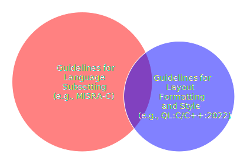

<a href="SECTION1.md"><b>NEXT&nbsp;»</b></a>

<h1 align="center" style="font-size:xxx-large;">Quantum Leaps Embedded C/C++ Coding Style (QL-C/C++:2022)</h1>

> __NOTE:__ This document is a work-in-progress and might be incomplete.

# Table of Contents
[0. Introduction](#0-introduction) 
&nbsp;&nbsp;[0.5 Licensing](#05-licensing) 

[1. White Space](SECTION1.md) 
&nbsp;&nbsp;[2.1 No Tabs](#21-no-tabs) 
&nbsp;&nbsp;[2.4 Directories and File Names](#24-directories-and-file-names) 

[2. Layout](SECTION2.md) 
&nbsp;&nbsp;[2.1 No Tabs](#21-no-tabs) 
&nbsp;&nbsp;[2.4 Directories and File Names](#24-directories-and-file-names) 

[3. Comments](SECTION3.md) 

[4. Naming Conventions](SECTION4.md) 

[6. Object Oriented Programming in C](SECTION6.md) 

[7. Design by Contract](SECTION7.md) 

# 0. Introduction
_Coding style_ refers to formatting, layout and styling of the source code as well as naming conventions and commenting guidelines. Adopting a _documented_ coding style is the first and perhaps the easiest step towards improving code portability, readability, uniformity and maintainability. All this results in lower cost of software ownership by promoting consistency and avoiding misinterpretations and guessing.

## 0.1 Focus on Functional Safety
The _Quantum Leaps' Embedded C/C++ Coding Style (QL-C/C++:2022)_ has been designed specifically with __safety-related__ embedded software in mind, where the code needs to undergo _certification_ to a safety standard, such as IEC 61508, IEC 62304, DO-178B/C, etc. Most functional safety standards recommend using safer _subsets_ of the C or C++ programming languages. For example, coding standards [MISRA-C:2012](#04-references) or [AUTOSAR-C++14](#04-references) specify such safer subsets of C90/C99 and C++14, respectively. 

## 0.2 MISRA-C and AUTOSAR-C++
This _Quantum Leaps' Embedded C/C++ Coding Style (QL-C/C++:2022)_ is intended to __complement__ the coding standards focused on subsetting the C or C++ programming language. Indeed, both [MISRA-C:2012](#04-references) and [AUTOSAR-C++14](#04-references) explicitly state that stylistic issues and code layout is intentionally left out in those standards. At the same time, they acknowledge and highly recommend that every project adapts a clear styling convention. This Coding Style fills that gap.

> __NOTE:__ In order to avoid any confusion, this document is called "Coding _Style_" as opposed to a "Coding _Standard_".

<em>Guidelines for Language Sub-setting vs. Guidelines for Layout and Style</em>

In order to reduce duplication, this Coding Style intentionally ommits the guidelines already present in the language-subsetting standards. Even so, there is necessarily some overlap, when the coding standards impose rules that are stylistic in nature. For example, MISRA-C:2012 required Rule 15.6 "The body of an iteration-statement or selection-statement shall be a compound statement" coincides with the stylistic issue of using braces in this Coding Style. But in all such cases, great care has been taken to avoid any conflicts between this Coding Style and MISRA-C or AUTOSAR-C++ Coding Standards. 

## 0.3 Rationale for the Guidelines
This Coding Style tries to avoid arbitrary rules and instead supplies a _rationale_ that explains how every proposed guideline helps preventing defects, improves understandability, or avoids confusion. Experience shows that once software developers understand _why_ a given rule is helpful or _how_ it prevents problems, they tend to better remember the rule and actually follow it. 

 
## 0.4 History
This Coding Style began as an internal document to specify the coding style used in the book _"Practical Statecharts in C/C++"_ [[PSiCC]](#04-references) published in June 2002. Later, this style has been modified for the publication of the second edition of the book _"Practical UML Statecharts in C/C++, 2nd Edition"_ [[PSiCC2]](#04-references) in October 2008. Later this style has been published as the Quantum Leaps Application Note _C/C++ Coding Standard_ [[QL-C/C++:2013]](#04-references), last revised in 2013. This version has been revised for QP/C/C++ 7.0.0 and re-formatted again for publication on GitHub in 2022.

## 0.5 Licensing
> __Copyright (c) 2005-2022 Quantum Leaps (www.state-machine.com)__.

This _"Quantum Leaps Embedded C/C++ Coding Style (QL-C/C++:2022)"_ is licensed under the terms of the __GNU Free Documentation License, Version 1.3__ or any later version (SPDX-License-Identifier: `GFDL-1.3-or-later`) published by the Free Software Foundation. A copy of the license is available in the file [LICENSE.txt](LICENSE.txt) including in this Git repository. 

## 0.6 Customizing
The _Quantum Leaps' Embedded C/C++ Coding Style (QL-C/C++:2022)_ is published as a set of editable markdown files and example code on GitHub with the explicit intent of being __customizable__. Customization of the guidelines presented herein may be done simply by forking this Git repository and applying the desired changes. The only conditions that we request are:

1. that the original [Copyright notice](#02-licensing) with the link to our website be preserved; and
2. that the customized style bears a clear note informing the recipients that it has been modified from the original.

## 0.7 References

|   |   |
|---|---|
| [C90]&nbsp;&nbsp;&nbsp;&nbsp;&nbsp;&nbsp;&nbsp;&nbsp;&nbsp;&nbsp;&nbsp;&nbsp;&nbsp;&nbsp;&nbsp;&nbsp;&nbsp;&nbsp;&nbsp;&nbsp;&nbsp;&nbsp;&nbsp; | _ISO/IEC9899:1990, Programming Languages – C_, ISO, 1990.  |
| [C99]            | _ISO/IEC9899:1999, Programming Languages – C_, ISO, 1999.  |
| [MISRA-C:2012]   | _MISRA C:2012 Guidelines for the use of the C language in critical systems_, MIRA, March 2013.  |
| [MISRA-C++:2008] | _MISRA C++ Guidelines for the use of the C++ language in critical systems_, MIRA, June 2008.  |
| [AUTOSAR-C++14]  | _Guidelines for the use of the C++14 language in critical and safety-related systems_, AUTOSAR AP, Release 2017-03. |
| [QL-C/C++:13]    | Quantum Leaps, _Application Note: C/C++ Coding Standard_, 2013, https://www.state-machine.com/doc/AN_QL_Coding_Standard.pdf
| [BARR-CS:2018]   | Michael Barr, _Embedded C Coding Standard (BARR-C:2018)_, 2018, https://barrgroup.com/coding-standard |
| [PSiCC:02]       | Miro Samek, _Practical Statecharts in C/C++_, CMP Books 2002. https://www.state-machine.com/psicc |
| [PSiCC2:08]      | Miro Samek, _Practical UML Statecharts in C/C++, 2nd Edition_, Newnes 2008. https://www.state-machine.com/psicc2 |
| [CODE2:04]       | Steve McConnell, _Code Complete, 2nd Ed_,Microsoft Press 2004. |
| [K&R:88]         | Brian Kernighan, Dennis Riche, _The C Programming Language, 2nd Ed_, Prentice Hall, 1988. |
| [PPP:11]         | Bjarne Stroustrup, _PPP Style Guide_, September 2011, https://www.stroustrup.com/Programming/PPP-style.pdf |
| [FDS:07]         | Jack Ganssle, _A Firmware Development Standard_, Version 1.4, Updated May, 2007 http://www.ganssle.com/fsm.htm |
| [OOP-C:08]       | Quantum Leaps, _Object-Oriented Programming in C_, https://www.state-machine.com/oop  |
| [DbC:16]         | Quantum Leaps, Key Concept: Design by Contract, https://www.state-machine.com/dbc |

<a href="SECTION1.md"><b>NEXT&nbsp;»</b></a>

