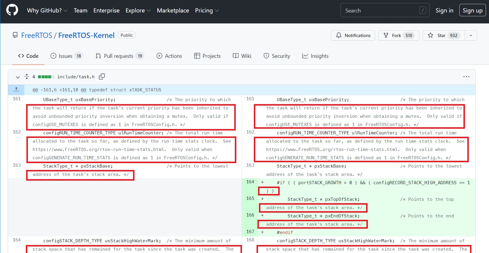

<a href="README.md"><b>«&nbsp;PREVIOUS</b></a>&nbsp;|&nbsp;
<a href="README.md"><b>TOC</b></a>&nbsp;|&nbsp;
<a href="SECTION2.md"><b>NEXT&nbsp;»</b></a>

# 1. White Space
Many software developers pay little attention to the white space in their source code, such as spaces, tabs, new-lines, etc. The common thinking is that compilers (C, C++, etc.) ignore white space anyway, so why bother? But, as a *professional* software developer you should not ignore white space, because it can cause all sorts of problems, some of them illustrated in the figure below:

<em>Examples of problematic white space in source code</em>

The guidelines in this category are intended for avoiding difficult to see errors and consistent code rendering on a wide variety of devices and platforms like: different screens, printers, and various code editors working on different computer platforms. These guidelines should apply to all ASCII documents, not only strictly to source code.

> **NOTE:** 
The problems caused by white space in the source code are particularly insidious, because you don't see the culprit. Also, inconsistent use of white space can lead to source files that are supposed to be identical might have different size on disk and can show as different in various version control systems. The strict control over the software versions is critical for any safety-certification and consequently inconsistencies in white space are unacceptable.

## 1.1 No Trailing White Space
**Amplification** 
The source code should have no trailing spaces or tabs after the last printable character in each line.

**Rationale** 
Trailing white space after the last printable character in line can cause bugs. For example, trailing white space after the C/C++ macro-continuation character '\' can confuse the C pre-processor and can result in a program error, as indicated by the bug icons.

## 1.2 End-of-Line Convention
**Amplification** 
All source code should consistently use only one end-of-line (EOL) convention as opposed to some lines ending with a different EOL convention than the others. For improved portability, this Coding Style recommends consistent use of the Unix end-of-line convention, with only one LF character (0x0A) terminating each line. Specifically, the DOS/Windows end-of-line convention with CR, LF character pair (0x0D, 0x0A) terminating each line is not recommended.

**Rationale** 
Inconsisten End-of-Line convention might cause compilation problems on Unix-like systems, such as Linux. (Specifically, the C preprocessor doesn’t correctly parse the multi-line macros.) On the other hand, most DOS/Windows compilers seem to tolerate the Unix EOL convention without problems.

## 1.3 No Tabs
**Amplification** 
No tab characters (0x9) are allowed anywhere in the source code. Gropus of spaces should be used instead of the tabs.

**Rationale** 
Tabs are rendered differently on different devices and bring only insignificant memory savings. Preferably, tabs should be disabled at the editor level. At the very least, they should be replaced by spaces before saving the file.

## 1.4 Line Width Limit
**Amplification** 
Lines of code or comments should never exceed **80** columns

**Rationale** 
In programming practice, the source code is very often copied-and-pasted and then modified, rather than created from scratch. For this to work effectively, it’s very advantageous to be able to see simultaneously and *side-by-side* both the original and the modified copy, without line wrapping that destroys the logical layout.

Also, differencing the code is a routinely performed action of any VCS (Version Control System) whenever you check-in or merge the code. Limiting the line widths allows to use the horizontal screen real estate much more efficiently for side-by-side-oriented text windows instead of much less convenient and error-prone top-to-bottom differencing.

<em>Example of code differencing with long lines wrapping</em>

> **Note** 
In this guideline the specific line width limit (80 in this case) is not of the key property. The really important is the consensus to set a limit for the length of lines.    

# Enforcement
To enforce the guidelines in this category it is highly recommended to use an **automated** white space cleanup utility to check and cleanup the source code after editing or, at the very least, before checking it into a version control system. Quantum Leaps provides such a cleanup utility called **[QClean](https://www.state-machine.com/qtools/qclean.html)**.

<a href="README.md"><b>«&nbsp;PREVIOUS</b></a>&nbsp;|&nbsp;
<a href="README.md"><b>TOC</b></a>&nbsp;|&nbsp;
<a href="SECTION2.md"><b>NEXT&nbsp;»</b></a>

